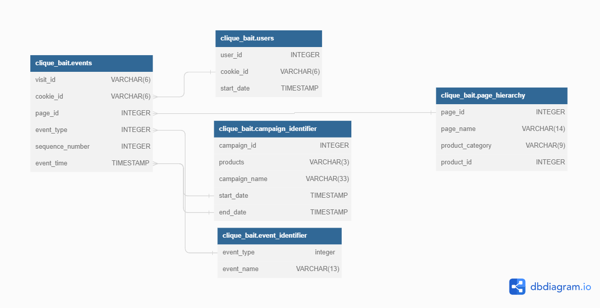
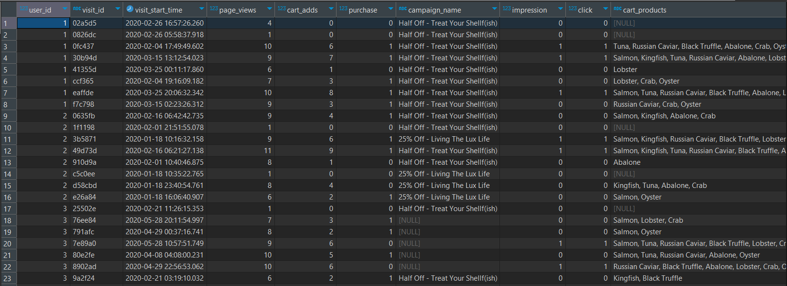

# DataMart
5th case study of the 8 week sql challenge

query written in Postgres

Study case details and questions: https://8weeksqlchallenge.com/case-study-6/

View the Solution script [here](https://github.com/EwaoluwaO/8-week-sql-challenge/blob/fc97a56282fb062f915f7da75b18fbad6ea7e19d/DataMart/Cliquebaitscript.sql)

Database Relationship

Result:

