# DataMart
5th case study of the 8 week sql challenge

query written in Postgres


Study case details and questions: https://8weeksqlchallenge.com/case-study-5/


View the Solution script [here](https://github.com/EwaoluwaO/8-week-sql-challenge/blob/fc97a56282fb062f915f7da75b18fbad6ea7e19d/DataMart/DataMartScript.sql)
## Data Cleansing
In a single query, perform the following operations and generate a new table in the data_mart schema named clean_weekly_sales:

Convert the `week_date` to a `DATE` format

Add a `week_number` as the second column for each `week_date` value, for example any value from the 1st of January to 7th of January will be 1, 8th to 14th will be 2 etc

Add a `month_number` with the calendar month for each `week_date` value as the 3rd column

Add a `calendar_year` column as the 4th column containing either 2018, 2019 or 2020 values

Add a new column called `age_band` after the original segment column using the following mapping on the number inside the segment value

|segment|age_band
|-------|--------|
|1|Young Adults|
|2|Middle Aged|
|3 or 4	|Retirees

Add a new demographic column using the following mapping for the first letter in the segment values:

| segment | demographic | 
| ------- | ----------- |
| C | Couples |
| F | Families |

Ensure all `null` string values with an `unknown` string value in the original segment column as well as the new age_band and demographic columns

Generate a new `avg_transaction` column as the sales value divided by transactions rounded to 2 decimal places for each record

Solution:
```sql
create table clean_weekly_sales as select to_date(week_date, 'DD/MM/YY') as week_date,
		extract (week from (to_date(week_date, 'DD/MM/YY'))) as week_number,
		extract (month from (to_date(week_date, 'DD/MM/YY'))) as month_number,
		extract (year from (to_date(week_date, 'DD/MM/YY'))) as calendar_year,
		(case when segment like '%1' then 'Young Adults'
			when segment like '%2' then 'Middle Aged'
			when segment = 'null' then 'unknown'
			else 'Retires'
			end) as age_band,
		region,platform,customer_type,
		(case when segment like 'C%' then 'Couples'
			when segment like 'F%' then 'Family'
			when segment = 'null' then 'unknown'
			else 'error'
			end) as demographic,
		transactions,sales,
		round(sales/transactions::numeric,2) as avg_transactions
from weekly_sales ws;
```
Result:
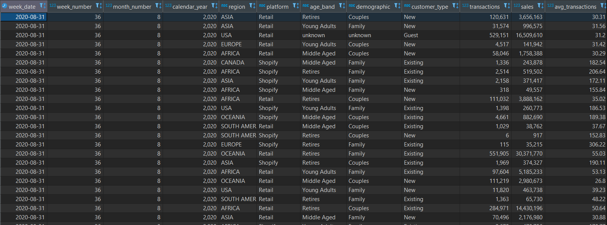

## 2. Data Exploration
What day of the week is used for each week_date value?

solution:
```sql
select week_date, to_char(week_date,'Day') 
from clean_weekly_sales cws;
```

Result:
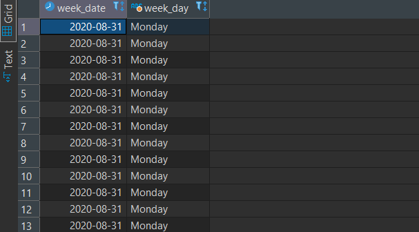

What range of week numbers are missing from the dataset?
```sql
WITH cte_all_weeks AS ( 
    SELECT GENERATE_SERIES (1,52) week_number
)
SELECT week_number 
FROM cte_all_weeks
WHERE week_number NOT IN (
    SELECT 
        DISTINCT week_number
    FROM clean_weekly_sales
    )
ORDER BY week_number;
```
Result:
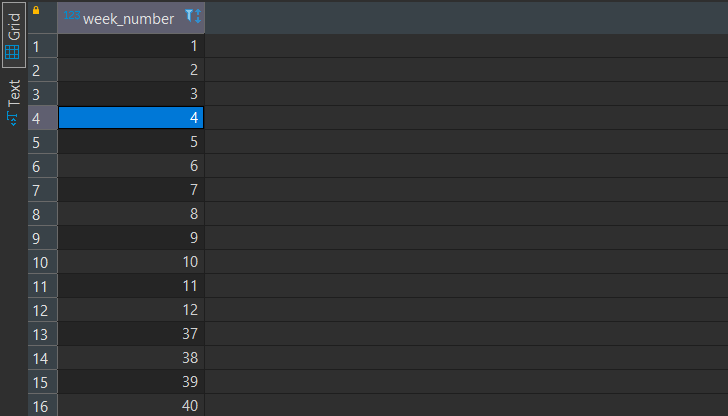

How many total transactions were there for each year in the dataset?
```sql
SELECT
    calendar_year,
    SUM(transactions) total_transaction
FROM clean_weekly_sales
GROUP BY calendar_year
ORDER BY calendar_year;
```

Result:
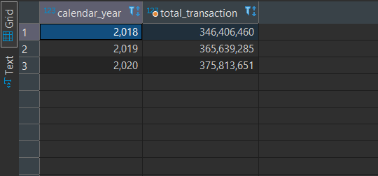

What is the total sales for each region for each month?
```sql
SELECT 
    region,
    calendar_year,
    month_number,
    SUM(sales) 
FROM clean_weekly_sales
GROUP BY region,month_number ,calendar_year 
ORDER BY calendar_year,month_number; 
```
Result
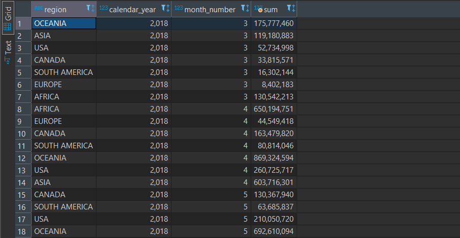

What is the total count of transactions for each platform
```sql
SELECT
    platform, 
    COUNT(*) number_transactions
FROM clean_weekly_sales
GROUP BY platform;
```
Result
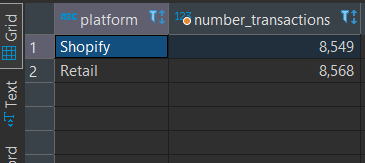

What is the percentage of sales for Retail vs Shopify for each month?
```sql
WITH platform_cte AS( 
SELECT 
    month_number,
    calendar_year,
    SUM(CASE WHEN platform = 'Retail' THEN sales ELSE 0 END) retail_sales,
    SUM(CASE WHEN platform = 'Shopify' THEN sales ELSE 0 END) shopify_sales,
    SUM(sales) total_sales
FROM clean_weekly_sales
GROUP BY month_number ,calendar_year 
)
SELECT 
   month_number,
   calendar_year, 
   ROUND((100*retail_sales/total_sales::numeric),2) pct_retail,
   ROUND((100*shopify_sales/total_sales::numeric),2) pct_shopify
FROM platform_cte ; 
```
Result
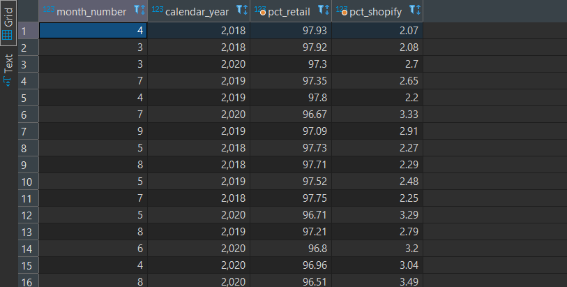

What is the percentage of sales by demographic for each year in the dataset?
```sql
SELECT 
    calendar_year,
    demographic,
    SUM(sales) annual_sales,
    ROUND((100*SUM(sales)/SUM(SUM(sales)) OVER (PARTITION BY demographic)),2) as pct
FROM clean_weekly_sales
GROUP BY calendar_year ,demographic 
ORDER BY calendar_year ,demographic ;
```
Result
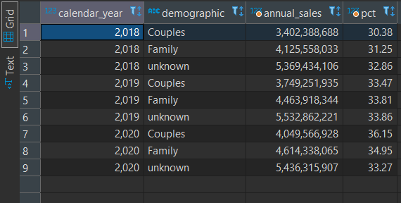

Which age_band and demographic values contribute the most to Retail sales?
```sql
SELECT 
    age_band,
    demographic,
    SUM(sales) total_sales,
    ROUND(100*SUM(sales)/((select sum(sales) from clean_weekly_sales cws where platform='Retail')::numeric),2) as pct
FROM clean_weekly_sales
WHERE platform = 'Retail'
GROUP BY age_band, demographic
ORDER BY total_sales desc;
```
Result
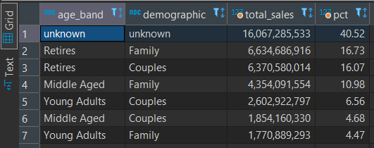

Can we use the avg_transaction column to find the average transaction size for each year for Retail vs Shopify? If not - how would you calculate it instead?
```sql
SELECT
    platform, 
    calendar_year,
    ROUND(AVG(avg_transactions),2) average_fr_average, 
    SUM(sales) /SUM(transactions) average_real
FROM clean_weekly_sales cws
GROUP BY platform,calendar_year
ORDER BY platform,calendar_year
```
Result
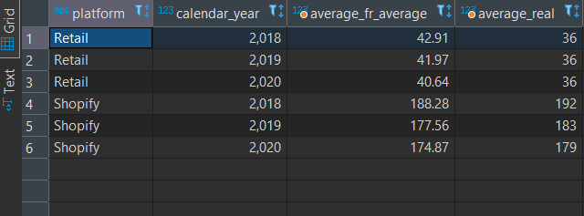

## 3. Before & After Analysis
This technique is usually used when we inspect an important event and want to inspect the impact before and after a certain point in time.

Taking the week_date value of 2020-06-15 as the baseline week where the Data Mart sustainable packaging changes came into effect.

We would include all week_date values for 2020-06-15 as the start of the period after the change and the previous week_date values would be before

Using this analysis approach - answer the following questions:

What is the total sales for the 4 weeks before and after 2020-06-15? What is the growth or reduction rate in actual values and percentage of sales?

we first need to find out what week 2020-06-15 lies in.

```sql
SELECT 
    DATE_PART('week','2020-06-15'::DATE) week_number;
```

its week 25, so 4 weeks before are weeks 21,22,23,24 . 4 weeks after the date are weeks 25,26,27,28.(week 25 is included)
```sql
WITH cte_summary AS(
SELECT
    week_number,
    SUM(CASE WHEN week_number BETWEEN 21 AND 24 THEN sales ELSE 0 END) sales_before,
    SUM(CASE WHEN week_number BETWEEN 25 AND 28 THEN sales ELSE 0 END) sales_after
FROM clean_weekly_sales
WHERE calendar_year = '2020' 
GROUP BY week_number
)
SELECT 
    SUM(sales_before) total_before,
    SUM(sales_after) total_after,
    SUM(sales_after)-SUM(sales_before) difference,
    ROUND(100*(SUM(sales_after)-SUM(sales_before))/SUM(sales_before),2) pct_change
FROM cte_summary;
```
Result
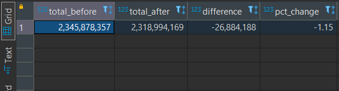

What about the entire 12 weeks before and after?
```sql
WITH cte_summary AS(
SELECT
    week_number,
    SUM(CASE WHEN week_number BETWEEN 13 AND 24 THEN sales ELSE 0 END) sales_before,
    SUM(CASE WHEN week_number BETWEEN 25 AND 36 THEN sales ELSE 0 END) sales_after
FROM clean_weekly_sales
WHERE calendar_year = '2020' 
GROUP BY week_number
)
SELECT 
    SUM(sales_before) total_before,
    SUM(sales_after) total_after,
    SUM(sales_after)-SUM(sales_before) difference,
    ROUND(100*(SUM(sales_after)-SUM(sales_before))/SUM(sales_before),2) pct_change
FROM cte_summary;
```
Result
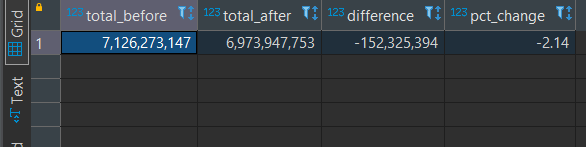

How do the sale metrics for these 2 periods before and after compare with the previous years in 2018 and 2019?
for four weeks:
```sql
with cte_summary as(
select
	calendar_year,
	SUM(case when week_number between 21 and 24 then sales else 0 end) sales_before,
	SUM(case when week_number between 25 and 28 then sales else 0 end) sales_after
from
	clean_weekly_sales
group by
	calendar_year 
)
select
	calendar_year,
	SUM(sales_before) total_before,
	SUM(sales_after) total_after,
	SUM(sales_after)-SUM(sales_before) difference,
	ROUND(100 *(SUM(sales_after)-SUM(sales_before))/ SUM(sales_before), 2) pct_change
from
	cte_summary
group by
	calendar_year
order by
	calendar_year;
```

Result

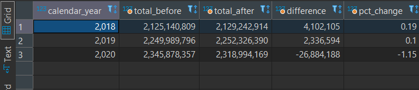

For 12 weeks

```sql
with cte_summary as(
select
	calendar_year,
	SUM(case when week_number between 13 and 24 then sales else 0 end) sales_before,
	SUM(case when week_number between 25 and 36 then sales else 0 end) sales_after
from
	clean_weekly_sales
group by
	calendar_year
)
select
	calendar_year,
	SUM(sales_before) total_before,
	SUM(sales_after) total_after,
	SUM(sales_after)-SUM(sales_before) difference,
	ROUND(100 *(SUM(sales_after)-SUM(sales_before))/ SUM(sales_before), 2) pct_change
from
	cte_summary
group by
	calendar_year
order by
	calendar_year;
```

Result
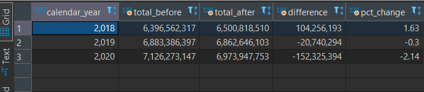
